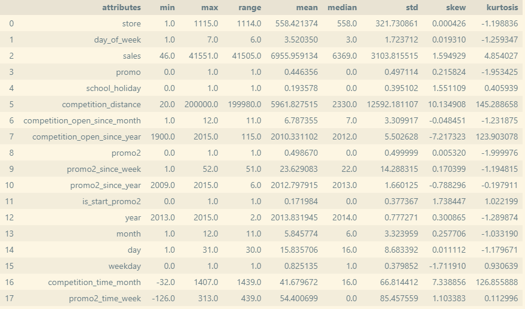
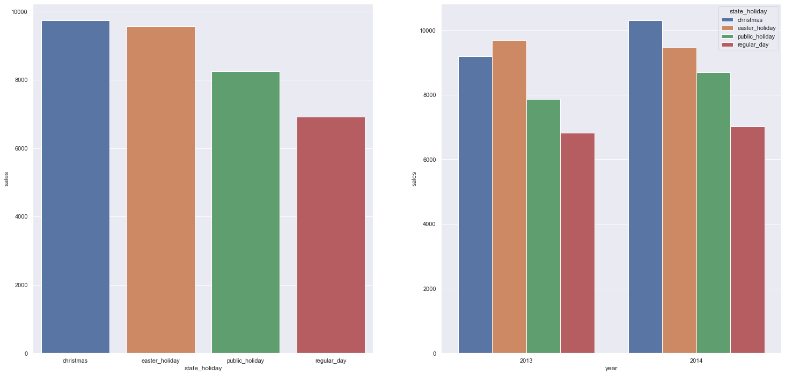
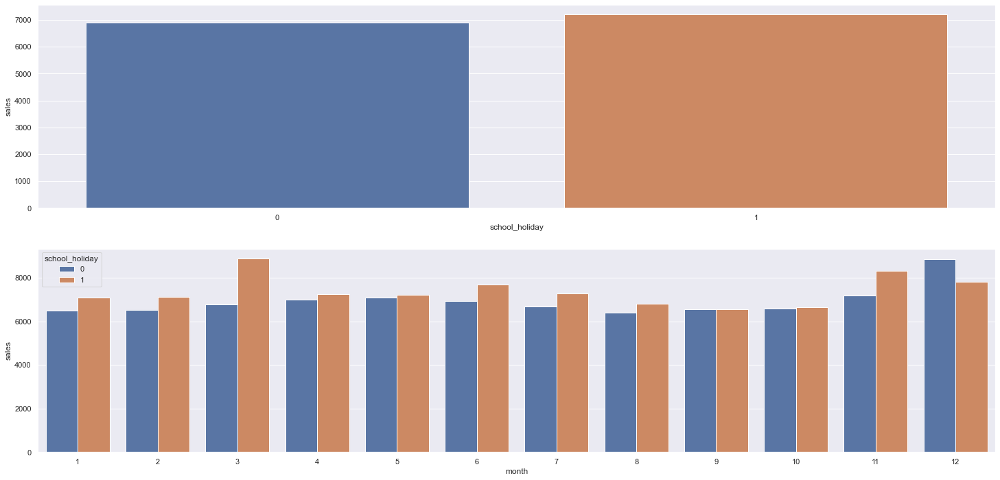
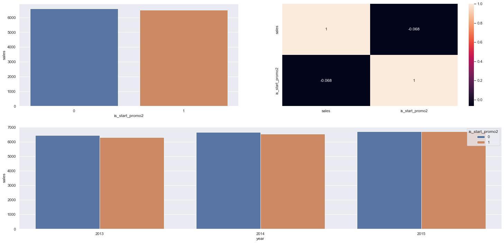
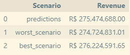

# ROSSMANN - SALES FORECASTING PROJECT

# Context

Rossmann is a pharmacy chain that operates over 3000 stores across European countries. The company's CFO held a meeting with Store Managers and requested the daily sales forecast for the next 6 weeks for 1115 stores that he intends to renovate. The managers then requested a sales forecast for their stores.

# Method

CRISP-DM

The CRISP-DM method was used for the development of this project.

CRISP-DM - Cross Industry Standard Process for Data Mining is a widely used methodology for solving data science problems. This method consists of six stages: Business Understanding, Data Understanding, Data Preparation, Modeling, Evaluation, and Deployment.

&nbsp;

# 1.0. Business Understanding
## 1.1. Business Question

What is the revenue of each store for the next six weeks?

## 1.2. Business Understanding

The CFO intends to make an investment to refurbish the stores but is struggling to determine the value of the investment. To do this, he needs to know how much revenue each store will generate over the next six weeks.

&nbsp;

# 2.0. Data Understanding
## 2.1. Data Collection

In this project, a dataset from a Kaggle competition was used. This dataset contains sales history from 2013-01-01 to 2015-07-31 for 1115 stores.

**2.1.1. Data Dictionary**

Feature|	Definition
-------|------------
Id|	an Id that represents a (Store, Date) pair within the test set
Store|	a unique Id for each store
Sales|	the turnover for any given day (this is what you are predicting)
Customers|	the number of customers on a given day
Open|	an indicator for whether the store was open: 0 = closed, 1 = open
StateHoliday|	indicates a state holiday: a = public holiday, b = Easter holiday, c = Christmas, 0 = None
SchoolHoliday|	indicates if the (Store, Date) was affected by the closure of public schools
StoreType|	differentiates between 4 different store models: a, b, c, d
Assortment|	describes an assortment level: a = basic, b = extra, c = extended
CompetitionDistance|	distance in meters to the nearest competitor store
CompetitionOpenSince[Month/Year]|	gives the approximate year and month of the time the nearest competitor was opened
Promo|	indicates whether a store is running a promo on that day
Promo2|	Promo2 is a continuing and consecutive promotion for some stores: 0 = store is not participating, 1 = store is participating
Promo2Since|	describes the year and calendar week when the store started participating in Promo2
PromoInterval|	describes the consecutive intervals Promo2 is started, naming the months the promotion is started anew. E.g. "Feb,May,Aug,Nov" means each round starts in February, May, August, November of any given year for that store

## 2.2. Data Exploration

**2.2.1. Numeric Variables**

&nbsp;

**2.2.2. Categorical Variables**

&nbsp;

**2.2.3. Top Insights**

**H1:** The average sales are higher during Christmas.

&nbsp;

**H2:** Stores sell more during school holidays.

&nbsp;

**H3:** Stores participating in Promo2 have lower average sales at the beginning of Promo2.

&nbsp;

**H4:** The average sales after the 10th day are lower.

&nbsp;

# 3.0. Data Preparation
**3.1. Numeric Variables**

- Min-Max-Scaler -> Used on variables that do not follow a normal distribution and do not have many outliers.

- Robust Scaler -> Used on variables that do not follow a normal distribution, with very high values.

- Log transformation -> Transformation used on the target variable to make it closer to a normal distribution.

**3.2. Categorical Variables**

- LabelEncoder -> Assigns a number to each class of the variable.

- Ordinal Encoding -> Used on variables that follow an order.

**3.3. Periodic Variables**

- Cyclical transformation -> Tries to bring out the real nature of the variable with a cyclic aspect - days, weeks, and months of the year.

**3.4. Feature Selection**

- To select the attributes used in the model, a method called Boruta was used, which finds the attributes that carry useful information for prediction.

&nbsp;

# 4.0. Data Modeling

## 4.1. Machine Learning Algorithms

In this stage, 4 machine learning models were tested using cross-validation. The table below shows the comparison between the models.

Random Forest and XGBoost had similar performance. The XGBoost model was chosen.

## 4.2. Final Model with Performance Optimization

Here, a method called Random Search was used to find parameters to optimize the model's performance.

Optimized Parameters:

    n_estimators: 3000,
    eta: 0.03,
    max_depth: 5,
    subsample: 0.7,
    colsample_bytree: 0.7,
    min_child_weight: 8

Optimized Model Performance:

Model Name|	MAE| MAPE|	RMSE
|---------|----|-----|-------|
XGBoost| 660.77| 0.0972| 954.64

&nbsp;

# 5.0. Algorithm Evaluation

## Error Interpretation - Business Performance

Result for some stores with the sales forecast, the best and worst-case scenarios according to the error that can be generated by the model.

&nbsp;

## Business Results

&nbsp;

## Machine Learning Model Performance

&nbsp;

# 6.0. Production Model

Telegram bot: The Telegram bot receives a message with the store number and makes a request to the API that returns the sales forecast for the next six weeks.

App: Application implemented on Streamlit Cloud. The API receives the request from the Telegram bot and returns the sales forecast from the trained machine learning model.

Demonstration

&nbsp;

# 7.0. Conclusion
In this project, a machine learning sales forecasting model was developed. In addition, an application was created that allows querying the model's forecasts via phone through a Telegram bot. This way, decision-makers will have greater convenience in obtaining important business information.

# 8.0 Next Steps
- Use another method to optimize the model's performance.
- Derive new features that bring information to improve the model's prediction.

# References

[CRISP-DM](https://www.datascience-pm.com/crisp-dm-2/)

[DS Community](https://membro.comunidadedatascience.com/)