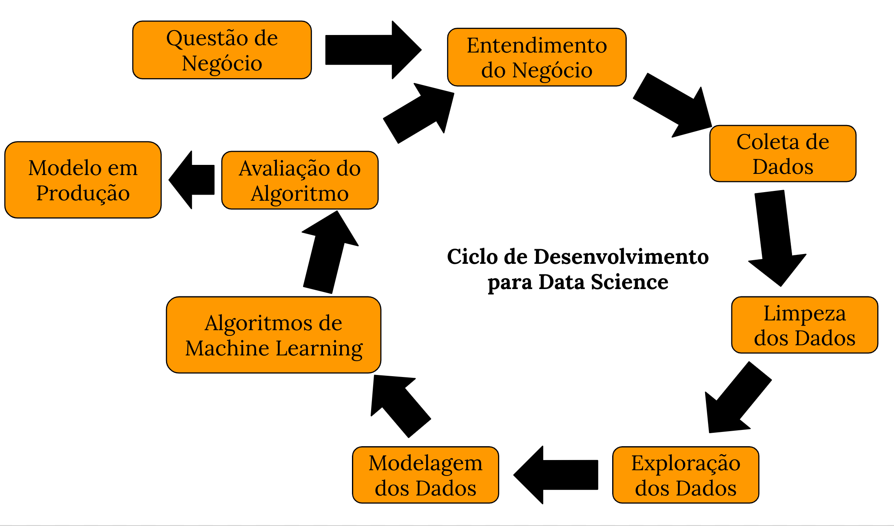
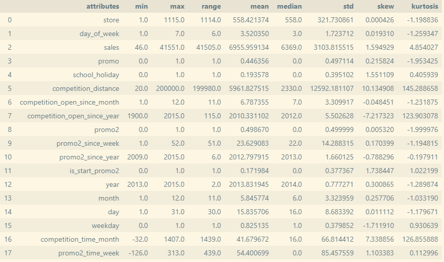
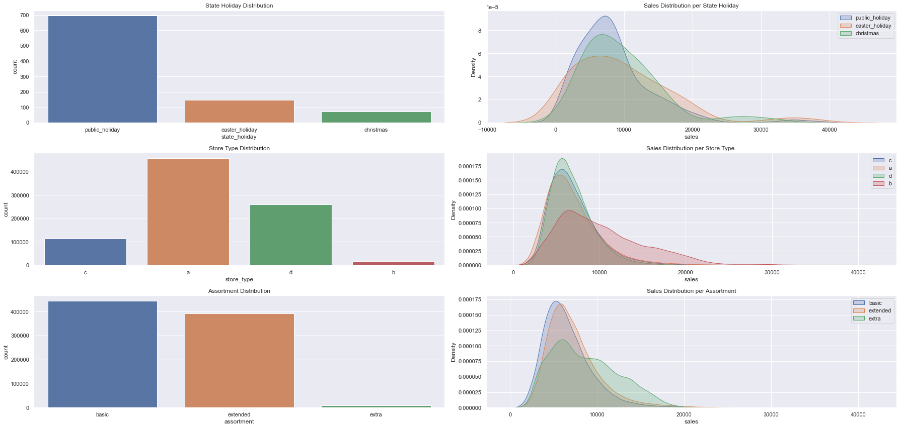
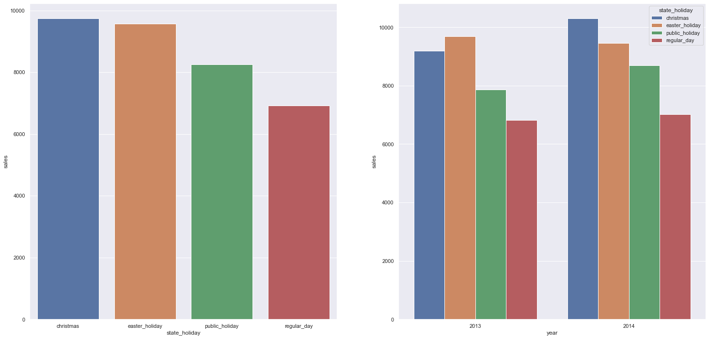
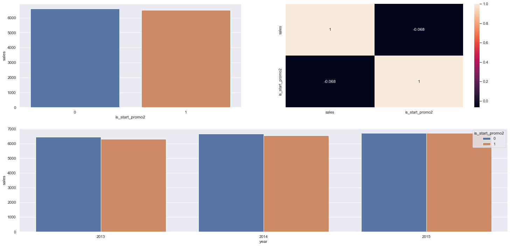
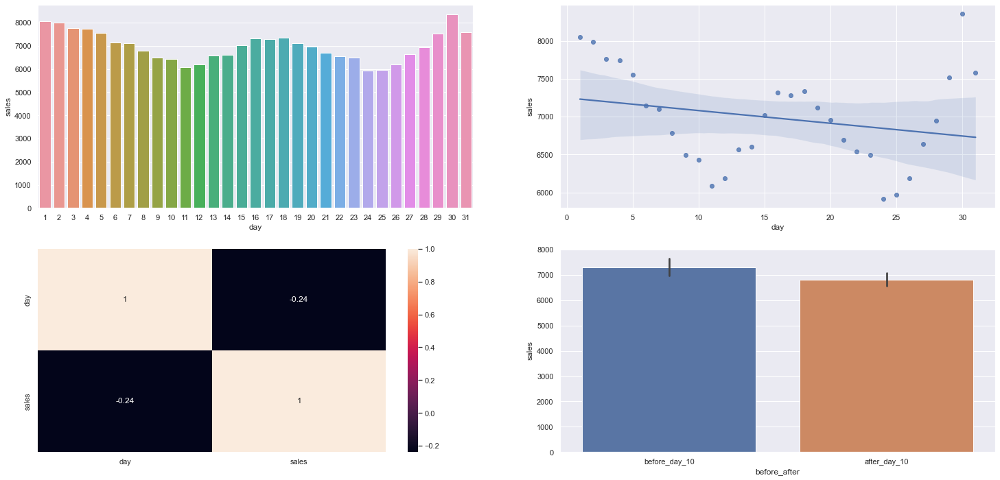
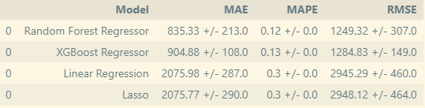
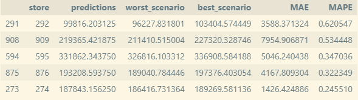
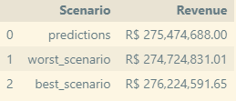
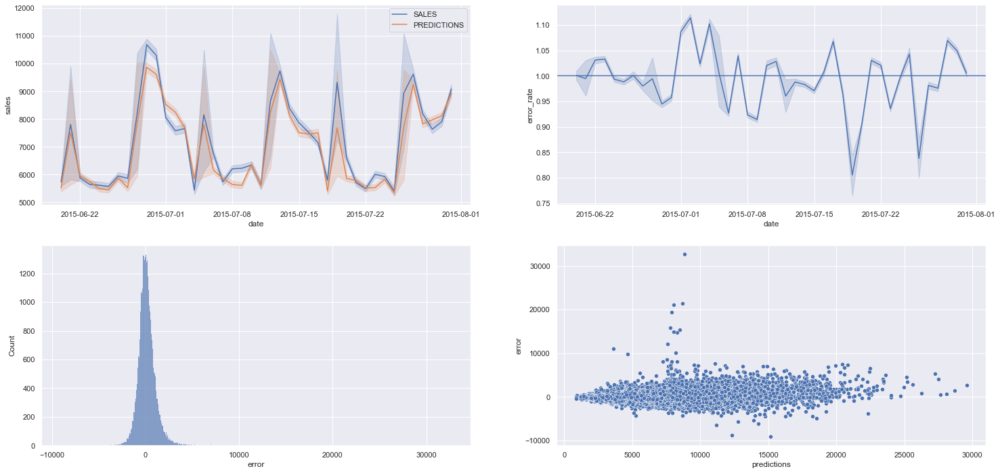

# ROSSMANN - PROJETO DE PREVISÃO DE VENDAS

# Contexto

A Rossmann é uma rede de farmácias que opera mais de 3000 lojas
em países europeus. O CFO da empresa fez uma reunião com os Gerentes de Loja e pediu que eles trouxessem a previsão diária das próximas 6 semanas de vendas de 1115 lojas que ele deseja reformar. Os gerentes, então, requisitaram uma previsão de vendas de suas lojas.

# Método

CRISP - DM

O método CRISP-DM foi utilizado para o desenvolvimento deste projeto.

O CRISP-DM - Cross Industry Standard Process for Data Mining (Processo Padrão Inter-Indústrias para Mineração de Dados é uma metodologia bastante utilizada para resolver problemas de ciência de dados. Esse método é constituido por seis etapas: Compreensão do Negócio, Compreensão dos Dados, Preparação dos Dados, Modelagem, Avaliação e Desenvolvimento.

&nbsp;

# 1.0. Compreensão do Negócio
## 1.1. Questão de negócio

 Qual a receita de cada loja nas próximas seis semanas?

## 1.2. Entendimento do Negócio

 O CFO pretende realizar um investimento para reformar as lojas, mas está com dificuldade em determinar o valor do investimento. Para isso ele precisa saber quanto de receita cada loja vai gerar nas próximas seis semanas.

&nbsp;

# 2.0. Compreensão dos Dados
## 2.1. Coleta de Dados

 Nesse projeto foi utilizada uma base de dados de uma [competição](https://www.kaggle.com/competitions/rossmann-store-sales/dat) do [Kaggle](https://www.kaggle.com/). Essa base de dados contém o histórico de vendas de 2013-01-01 a 2015-07-31 de 1115 lojas.

**2.1.1. Dicionário dos dados**

Feature| Definition
----------|-----------|
Id | an Id that represents a (Store, Date) duple within the test set
Store | a unique Id for each store
Sales | the turnover for any given day (this is what you are predicting)
Customers | the number of customers on a given day
Open | an indicator for whether the store was open: 0 = closed, 1 = open
StateHoliday | indicates a state holiday. Normally all stores, with few exceptions, are closed on state holidays. Note that all schools are closed on public holidays and weekends. a = public holiday, b = Easter holiday, c = Christmas, 0 = None
SchoolHoliday | indicates if the (Store, Date) was affected by the closure of public schools
StoreType | differentiates between 4 different store models: a, b, c, d
Assortment | describes an assortment level: a = basic, b = extra, c = extended
CompetitionDistance | distance in meters to the nearest competitor store
CompetitionOpenSince[Month/Year] | gives the approximate year and month of the time the nearest competitor was opened
Promo | indicates whether a store is running a promo on that day
Promo2 | Promo2 is a continuing and consecutive promotion for some stores: 0 = store is not participating, 1 = store is participating
Promo2Since | describes the year and calendar week when the store started participating in Promo2
PromoInterval | describes the consecutive intervals Promo2 is started, naming the months the promotion is started anew. E.g. "Feb,May,Aug,Nov" means each round starts in February, May, August, November of any given year for that store

## 2.2. Exploração dos Dados 

**2.2.1. Variáveis númericas**

&nbsp;

**2.2.2. Variáveis Categóricas** 

&nbsp;

**2.2.3. Top Insights**

**H1**: A média de vendas é maior no Natal.

&nbsp;

**H2**: As lojas vendem mais durante os feriados escolares.

&nbsp;

**H3**: Lojas que participam da promo2 têm média de vendas menor no início da promoção 2.

&nbsp;

**H4**: A média de vendas após o dia 10 é menor.

&nbsp;

# 3.0. Preparação dos Dados

**3.1. Variáveis Numéricas**

    Min-Max-Scaler -> Utilizado em variáveis que não seguem um distribuição normal e não têm muitos outliers.

    Robust Scaler -> Utilizado em variáveis que não seguem uma distribuição normal, com valores muito altos.

    Log transformation -> Transformação utilizada na variável target para deixá-la com uma distribuição mais próxima da normal.

**3.2. Variáveis Categóricas**

    LabelEncoder -> Atribui um número a cada classe da variável.

    Ordinal Encoding -> Utilizado em variáveis que seguem uma ordem.

**3.3. Variáveis periódicas**

    Transformação cíclica -> tenta trazer a natureza real da variável com aspecto cíclico - dias, semanas, e meses do ano.

**3.4. Feature Selection**

    Para selecionar os atributos utilizados no modelo foi utilizado um método chamado Boruta, que encontra os atributos que carregam informações úteis para predição.

&nbsp;

# 4.0. Modelagem dos Dados

## 4.1. Algoritmos de Machine Learning

Nesta etapa, 4 modelos de machine learning foram testados utilizando [validação cruzada](https://scikit-learn.org/stable/modules/cross_validation.html). A tabela a seguir mostra a comparação entre os modelos.

Random Forest e XGBoost tiveram um desempenho parecido. Optamos pelo modelo do XGBoost.

## 4.2. Modelo Final com Otimização de Performance

Aqui, um método chamado [Random Search](https://scikit-learn.org/stable/modules/generated/sklearn.model_selection.RandomizedSearchCV.html) foi utilizado para encontrar os parâmetros para otimizar a performance do modelo. 

Parâmetros Otimizados:

    n_estimators: 3000,
    eta: 0.03,
    max_depth: 5,
    subsample: 0.7,
    colsample_bytree: 0.7,
    min_child_weight: 8}

Perfomance do Modelo Otimizado:

 Model Name|MAE|MAPE|RMSE
|----------|---|----|----|
XGBoost|660.77|0.0972|954.64

&nbsp;

# 5.0. Avaliação do Algoritmo

## Interpretação do Erro - Performance do negócio

Resultado de algumas lojas com a previsão de vendas, o melhor e o pior cenário de acordo com o erro que pode ser gerado pelo modelo.

&nbsp;

## Resultados para o Negócio

&nbsp;

## Performance do Modelo de Machine Learning

&nbsp;

# 6.0. Modelo em Produção

Bot do telegram: O bot do telegram recebe a mensagem com o número da loja e faz uma requisição a API que retorna a previsão de vendas das próximas seis semanas.

App: Aplicação implementada no streamlit cloud. A API recebe a requisição do bot do telegram e retorna a previsão de vendas do modelo de machine learning treinado.

**Demonstração**

&nbsp;

# 7.0. Conclusão

Nesse projeto, um modelo de machine learning de previsão de vendas foi desenvolvido. Além disso, foi criada uma aplicação que permite consultar as previsões do modelo por meio do telefone através de um bot do telegram. Dessa forma, os tomadores de decisão terão maior praticidade para obter informações importantes sobre o negócio.

# 8.0 Próximos passos

Utilizar outro método para realizar a otimização de performance do modelo.
Derivar novas features que tragam informações que melhorem a predição do modelo.

# Referências

[CRIPS-DM](https://www.datascience-pm.com/crisp-dm-2/)

[Comunidade-DS](https://membro.comunidadedatascience.com/)